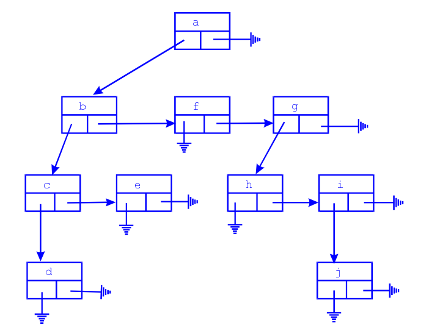

# Geotree - Arvore genérica de figuras geométricas
Trabalho da disciplina Estruturas de Dados, 2019.1 PPG IC-UFF.



## Enunciado

Trabalho Computacional: implementação das funções de árvores genéricas no número de filhos, árvores n-árias, 
e no tipo de informação armazenada, testando com as seguintes figuras geométricas: círculo, quadrado, retângulo, 
trapézio e triângulo:
* Deve ser permitido ao usuário do sistema: 
(a) buscar figuras geométricas, por meio de um código único; 
(b) imprimir informações relevantes, tanto da árvore, quanto das figuras, incluindo-se sua área; 
(c) inserir novas figuras; 
(d) retirar figuras, passando seus descendentes para outro pai; 
(e) destruir a árvore; 
(f) alterar as dimensões de figuras;
* Transformar a árvore genérica numa árvore binária de busca balanceada, baseando-se no código único;
* Converter a árvore genérica numa árvore B, baseando-se no código único;
* A entrada será fornecida por meio de arquivos texto. O arquivo texto será composto das seguintes informações, 
separadas por '/': código único, código único do pai (sendo que a raiz tem código do pai igual a zero) e as 
figuras geométricas, incluindo seu nome;
* As dimensões das figuras geométricas obedecerão ao seguinte padrão: 
(a) se a figura for um círculo ou um quadrado, uma única dimensão será informada (ou o raio, ou o lado, respectivamente); 
(b) se a figura for um triângulo ou um retângulo, as duas dimensões informadas serão a base e a altura;
(c) se a figura for um trapézio, três dimensões serão informadas, nessa ordem, base menor, base maior e altura;
* A estrutura deve ser totalmente destruída pelo seu programa antes da execução ser finalizada;

Exemplo de entrada, dado por um arquivo:
```
1/0/TRI 3 2
2/1/RET 3 3
3/1/TRA 2 3 4
4/1/CIR 4
5/4/QUA 3
6/2/RET 2 2
7/5/TRA 1 2 3
8/5/CIR 2
9/4/QUA 1
10/1/TRI 1 2

```
PORÉM, SEU CÓDIGO DEVE FUNCIONAR COM QUALQUER ENTRADA QUE SEGUE O PADRÃO SUPRACITADO;

## Executanto o programa

Para compilar: 
```
make main
```

Para rodar:
```
./main
```

### Exemplo de comandos

Para carregar uma arvore a partir de um arquivo txt:
```
gentree load in/exemplo.txt
```

Para exibir a arvore no terminal:
```
gentree print

 1 (0) 
--- 2 (1) 
------ 6 (2) 
--- 3 (1) 
--- 4 (1) 
------ 5 (4) 
--------- 7 (5) 
--------- 8 (5) 
------ 9 (4) 
--- 10 (1)
```

Para inserir um novo elemento, no caso 11 se torna filho de 3:
```
gentree insert 11/3/CIR 3
```

Para remover um elemento, por exemplo o nó de código 4:
```
gentree remove 4
```

Para sair do programa:
```
exit
Fim do programa ...
```

OBS:
* Apos cada operação você pode exibir a arvore no console (gentree print ou gt -p) para poder visualizar como a arvore está se comportando.
* Todos comandos possuem abreviações, por exemplo, se desejar exibir a arvore no console também pode ser executado o comando `gentree -p`, `gt print` ou mesmo `gt -p`.

## Executanto testes

Para compilar: 
```
make gentree_test
```

Para rodar:
```
./gentree_test
```
